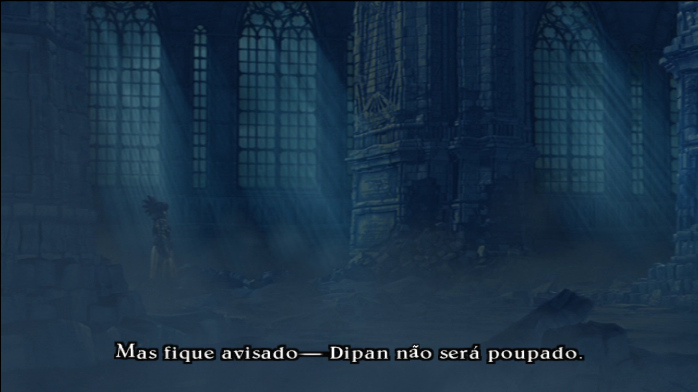
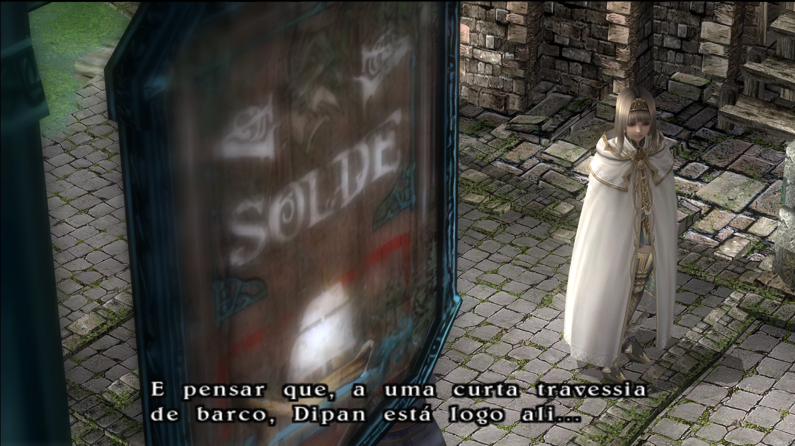
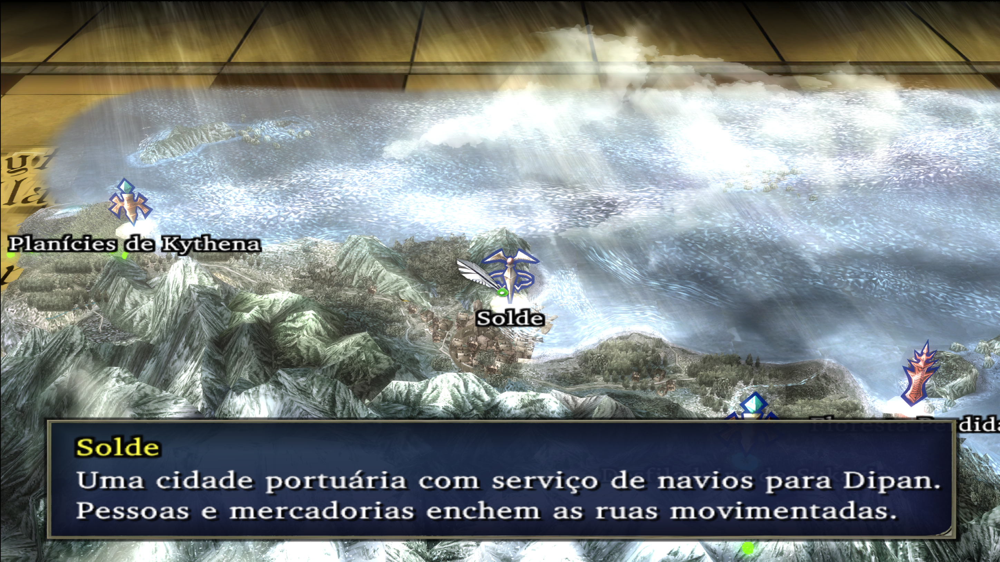
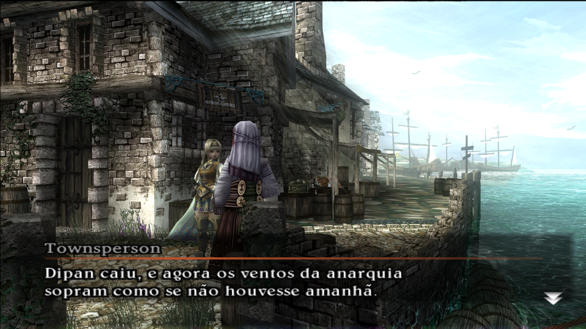
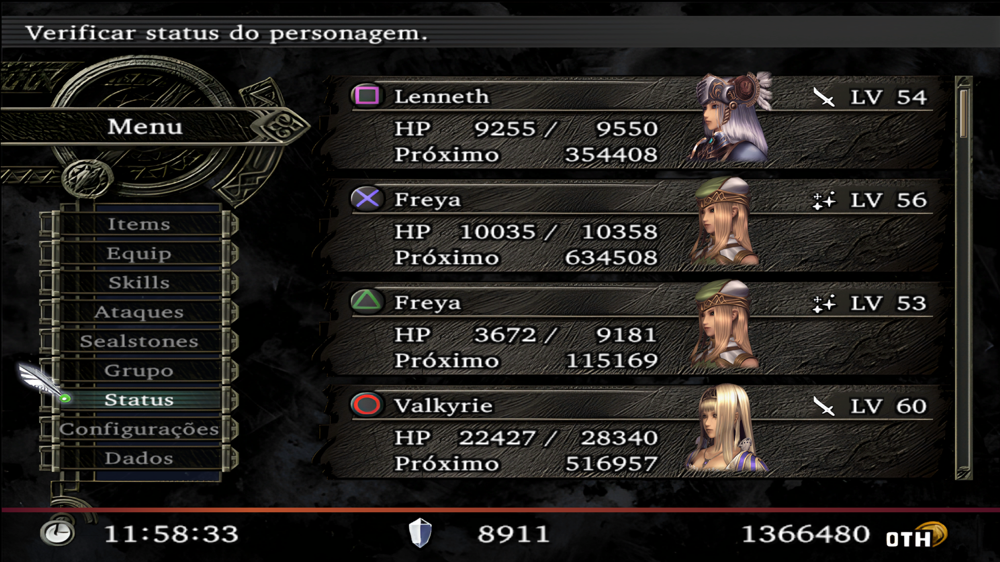
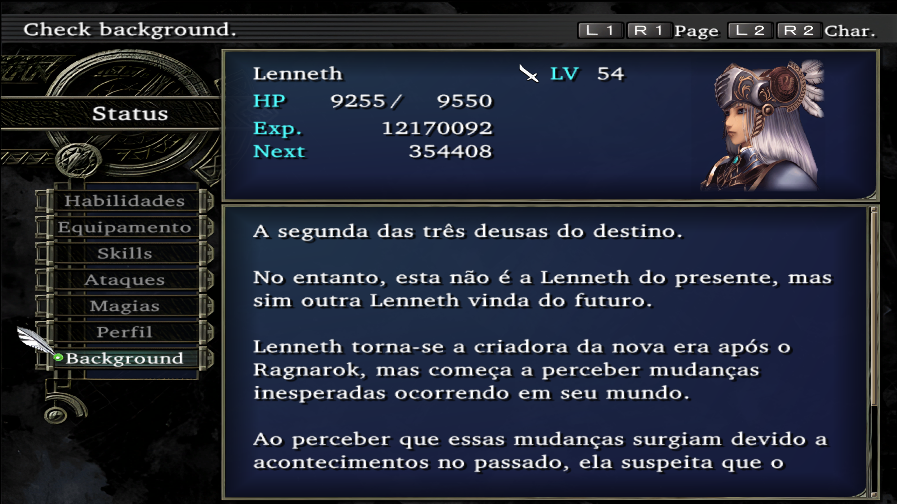

# Valkyrie Profile 2 - Silmeria Translation

## Cutscenes

### Container 0010
Title cutscene.

### Resource 0029
World map location title and descriptions.

### Resource 0033
Solde's Soul Street NPC dialogues

### Resource 1195
Second part of the first cutscene.

### Resource 1197
First cutscene.

### Resource 1277
Palace of the Venerated Dragon cutscene.

### Resource 1283
Vs Hrist cutscene.

### Resource 1299
Post Hrist battle cutscene.

### Resource 1337
Include some boss battle cutscene dialogue.

## Menu

### Container 0010
Game boot texts.

### Container 0641
Shop texts.

### Container 0643
Menu options.

### Container 0650
Menu. includes character's background/profile, item/spells/attacks/skill name and descriptions.

## Images

